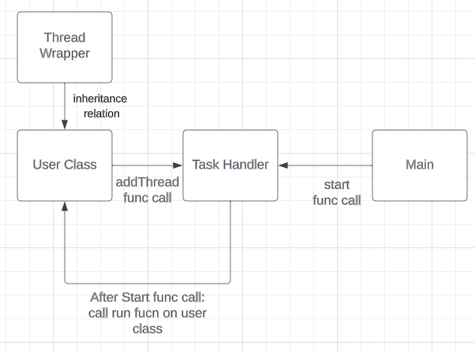

# Threading API Over view
This api is meant to make it so that the user doesn't have to worry about the complexities of threading when they wish to add new task, thread, operations, and functionality to cse projects that lervage this api. 



## Task Handler
This class is the bin that holds all the threads. It keeps a dictionary that holds the class object, thread, and a name for each thread that the system is running. It also allows for communictaion between threads. 

### Functions
1. `__init__`: This fucntion sets up the basic class sturcter. One thing to note is that it expects to recive a `coms` varible with is the `messageHandler` class from the `loggging_system_display_python_api`. It will auto matically add this as a thread that needs to be run. 
2. `add_thread`: adds a thread to the dictinary. It does allow for args to be passed in if the user desirs. 
3. `start`: starts the threads if the dictionary if they haven't been started yet. 
4. `get_thread_status`: check all threads to see how things are going.
5. `kill_Tasks`: sets threads `__RUNNING` vars to false. It is up to the user to make sure this ends the task.
6. `pass_request`: takes in a thread name and a list of args, the first index in the list should be the function name that the user wants to call. In additional args can be store after that first index in the list. It returns a request id. 
7. `pass_return`: takes in a thread name and a request id. Then checks to see if there is a return value for that request. If there is it returns that. Otherwise it returns None. 

## Thread Wrapper
This class is meant to be inherited by users class. It provides the implemenations that `Task Handler` needs inorder to run. 

### Functions
1. `__init__`: sets up locks and class structure. NOTE: this class does not use the `messgeHandler`. That is left up to the user to decided if and how they would like to handling logging for their threads. 
2. `get_status`: Returns the status of the current thread. Notice the mutex lock, as multiple threads may request the status.
3. `set_status`: the child class calls this and passes the thread a status.
4. `get_running`: This returns the boolean `__RUNNING`, this is used to communicate if the thread should be active or not.
5. `kill_task`: sets `__RUNNING` to false, the user is resposable for making sure the task finishes. 
6. `make_request`: This function wants the function name to be called in the class. Then it adds it to the list of 
task to be done.
7. `get_request`: takes a request id, then checks to see if it has been completed. If it has it returns any return value from that task. Otherwise it returns none. 
8. `get_next_request`: Returns the next thing in the FIFO queue.
9. `complete_request`: adds the completed task to the dictinary `__completed_requestes` with the `return_val` (what that task returned when completed) as the value in that dictionary.
10. `run`: repeately checks to see if there are task to be exicuted. If there are it excicutes them. 

# How To
This api is built to just work in as many cases as possible. (Or as many as Shawn could think of when writting it. So probably not that many...) Anyways, lets talk about a basic use case and move to more complex ones. 
## General use
If you want to just use the basic implementation of this just simple have your class inherite the `Thread Wrapper`. Just make sure to call `super().__init__()` so that the parent classes construct will be called. NOTE: if you want to have a class that runs continusly, you DO NOT have to implement a `run` function. A continus `run` function is implemented by `Thread Wrapper`. However in many cases it may not be desirable to have a continus `run` function. Thus the `run` function needs to be implemented by the users class. 
### Example of user class (Continus run)
```python
from threading_python_api.threadWrapper import threadWrapper


class usersClass (threadWrapper):
    def __init__(self, coms=None):
        super().__init__()
        self.__coms = coms # The user will probably want a messgeHandler class, but it is not stricly required.
        #Users code after this point.   
    def users_function:
        #user defines any number of functions.     
```
### Example of how to call user class  (Continus run)
```python
from logging_system_display_python_api.messageHandler import messageHandler
from threading_python_api.taskHandler import taskHandler
from usersClass import usersClass

def main():
    coms = messageHandler() #make the messge handler for internal coms

    threadPool = taskHandler(coms) #make the thread pool.

    userObj = usersClass(coms)

    threadPool.add_thread(userObj.run, 'Users class', userObj) # add the users class to the thread pool.

    threadPool.start()

    #keep the main thread alive for use to see things running. 
    running = True
    while running:
        try:
            threadPool.get_thread_status()
            time.sleep(0.35)
        except KeyboardInterrupt:
            running = False
        
    
    threadPool.kill_tasks()

```
Things to note about the example
1. to call the `users_function` some where in the code, and assuming that the the `messageHandler` class is call `self.__coms`, the function call would be: `self.__coms.send_request('Users class', ['users_function'])`
2. That the main thread needs to stay alive while other threads are running. In other words the main thread does not wait for all child threads to finish exicution. That is the purpose of the `while running` loop.
3. `userObj.run` doesn't have to be the function that is pass to the `Task Handler`. Any function can be passed, for easy of reading the code I ussally name it run. 

### Example of over riding parent class functions
```python
from threading_python_api.threadWrapper import threadWrapper


class usersClass (threadWrapper):
    def __init__(self, coms=None):
        super().__init__()
        self.__coms = coms # The user will probably want a messgeHandler class, but it is not stricly required.
        #Users code after this point.   
    def users_function_with_args(args):
        #user defines any number of functions.   
    def run(args):
        #some deisred user function
```
```python
from logging_system_display_python_api.messageHandler import messageHandler
from threading_python_api.taskHandler import taskHandler
from usersClass import usersClass

def main():
    coms = messageHandler() #make the messge handler for internal coms

    threadPool = taskHandler(coms) #make the thread pool.

    userObj = usersClass(coms)

    threadPool.add_thread(userObj.run, 'Users class', userObj, args=args) # add the users class to the thread pool.

    threadPool.start()

    #keep the main thread alive for use to see things running. 
    running = True
    while running:
        try:
            threadPool.get_thread_status()
            time.sleep(0.35)
        except KeyboardInterrupt:
            running = False
        
    
    threadPool.kill_tasks()

```
Things to note about the example
1. This now overrides the `Thread Wrappper run` function. The user is now free to decide how to implerment run.
2. The implementation of `main()` does not change, excepte for one pramater on the `add_thread` function call.
3. To call the `users_function_with_args` some where in the code, and assuming that the the `messageHandler` class is call `self.__coms`, the function call would be: `self.__coms.send_request('Users class', ['users_function_with_args',arg1, arg2, arg3, ...])`